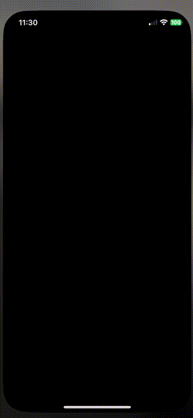

# SequencerPattern
This repository contains a sample iOS application. The app demonstrates how to implement Sequencer patterns to solve the startup iOS sequence problem by prioritizing and parallelizing tasks. This is the base code referenced in the post [iOS Start up sequence pattern](https://javios.eu/swift/ios-start-up-sequencer-pattern/)

## 🎥 Demo Video

Check out the app in action!  
  

## Requirements

- **Xcode 15.0 or later**
- **iOS 16.0 or later**
- **Swift 6.0**